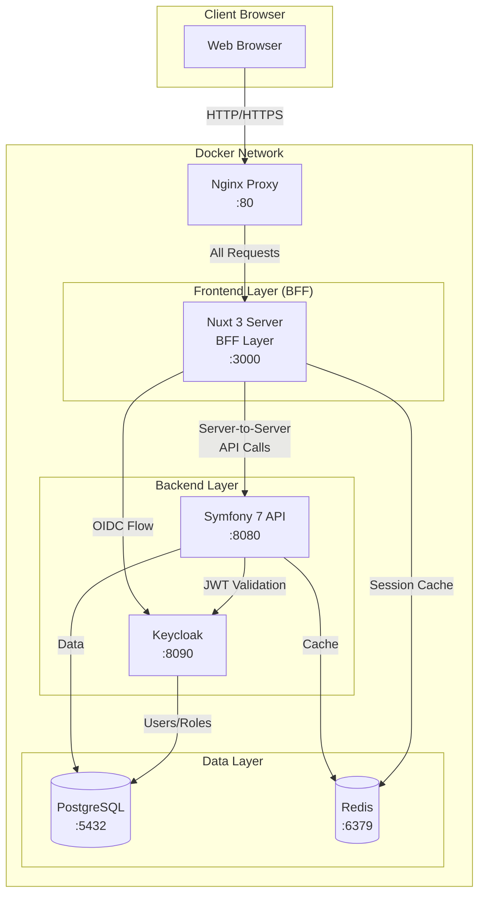

# System Architecture Overview

## Stack Components

### Frontend - Nuxt 3
- **Framework**: Nuxt 3 with Vue 3 Composition API
- **UI Library**: Nuxt UI (based on Tailwind CSS and Headless UI)
- **Port**: 3000
- **Features**:
  - Server-Side Rendering (SSR)
  - Auto-imports for components and composables
  - TypeScript support
  - Keycloak authentication integration via OIDC

### Backend - Symfony 7 with API Platform
- **Framework**: Symfony 7.x LTS
- **API**: API Platform 3.x
- **Port**: 8080
- **Features**:
  - RESTful API with OpenAPI documentation
  - GraphQL support (optional)
  - JWT authentication via Keycloak
  - Doctrine ORM for database management
  - Symfony Security component integration

### Authentication - Keycloak
- **Version**: Latest stable (24.x)
- **Port**: 8090
- **Features**:
  - Centralized identity and access management
  - OpenID Connect (OIDC) provider
  - User registration and management
  - Role-Based Access Control (RBAC)
  - Multi-factor authentication support

### Database - PostgreSQL
- **Version**: 16.x
- **Port**: 5432
- **Usage**:
  - Primary database for Symfony backend
  - Keycloak database (separate schema)

### Development Tools
- **Docker & Docker Compose**: Container orchestration
- **Nginx**: Reverse proxy for production
- **Redis**: Session storage and caching (optional)

## Architecture Diagram (Backend for Frontend Pattern)

## Backend for Frontend (BFF) Pattern

The application implements a BFF pattern where:
- **Nuxt Server** acts as the BFF layer, handling all client requests
- **No direct communication** between browser and Symfony API
- **Server-side API calls** from Nuxt to Symfony with better security
- **Token management** handled server-side, reducing client-side security risks
- **API aggregation** possible at the BFF layer for optimized client communication

## Communication Flow

### Authentication Flow (BFF Pattern)
1. User accesses the application via browser
2. Nuxt server handles the request
3. Nuxt server initiates OIDC flow with Keycloak
4. User authenticates via Keycloak
5. Keycloak returns tokens to Nuxt server
6. Nuxt server stores tokens in secure server-side session
7. Session cookie sent to browser (httpOnly, secure)

### API Request Flow (BFF Pattern)
1. Browser makes request to Nuxt server endpoint
2. Nuxt server retrieves tokens from session
3. Nuxt server makes server-to-server API call to Symfony
4. Symfony validates JWT with Keycloak
5. API Platform processes the request
6. Response returned to Nuxt server
7. Nuxt server processes/aggregates data if needed
8. Final response sent to browser

## Security Considerations

### Network Security
- All services run in isolated Docker containers
- Inter-service communication via Docker network
- External access only through Nginx reverse proxy
- HTTPS enforced in production

### Authentication Security
- JWT tokens with short expiration (15 minutes)
- Refresh tokens for seamless re-authentication
- Secure token storage in httpOnly cookies
- CSRF protection enabled

### API Security
- Rate limiting on API endpoints
- CORS configuration for frontend origin
- Input validation and sanitization
- SQL injection prevention via Doctrine ORM

## Development vs Production

### Development
- Hot module replacement for frontend
- Symfony debug mode enabled
- Docker volumes for code synchronization
- Keycloak in development mode
- Database with sample data

### Production
- Nuxt in production build
- Symfony with compiled container
- Environment variables for configuration
- Keycloak in production mode with SSL
- Database with backup strategy
- Redis for session and cache management

## Scalability Considerations

- **Horizontal Scaling**: API and frontend can be scaled independently
- **Load Balancing**: Nginx can distribute traffic across multiple instances
- **Caching Strategy**: Redis for API response caching
- **Database Optimization**: Read replicas for heavy read operations
- **CDN Integration**: Static assets served via CDN

## Monitoring and Logging

- **Application Logs**: Centralized logging via Docker
- **Performance Monitoring**: APM integration points
- **Health Checks**: Docker health checks for all services
- **Metrics**: Prometheus-compatible metrics endpoints